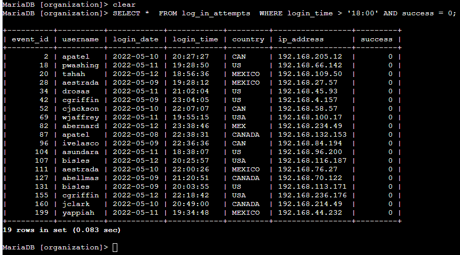
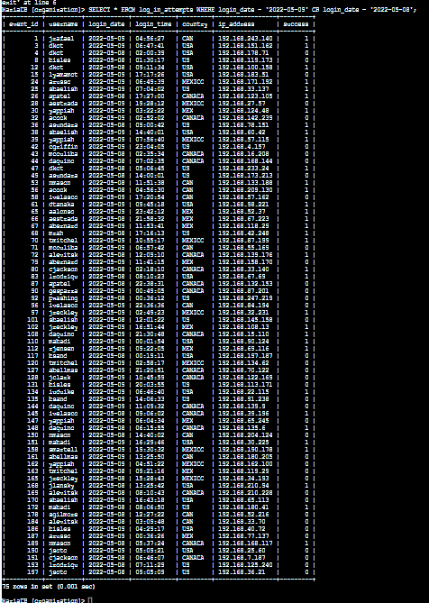
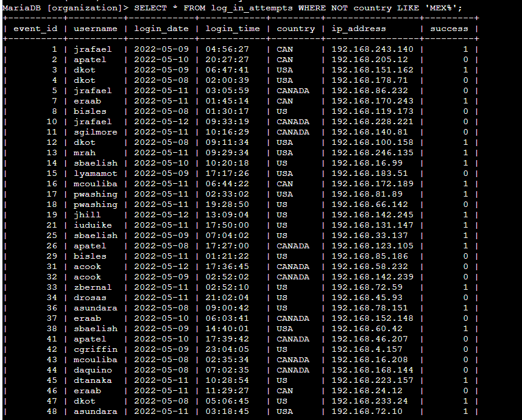
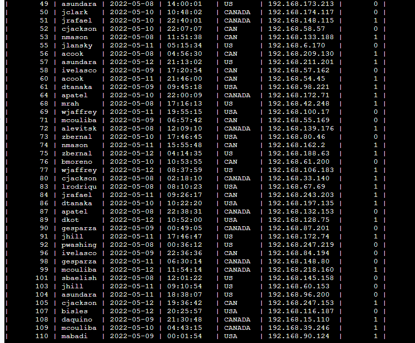
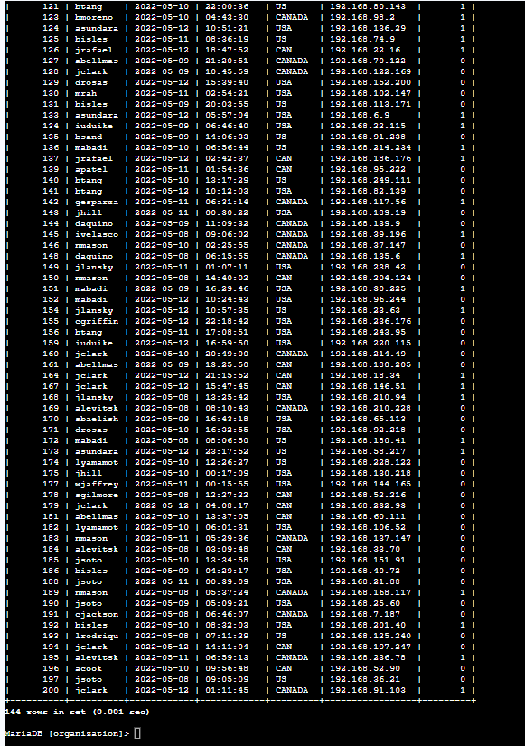
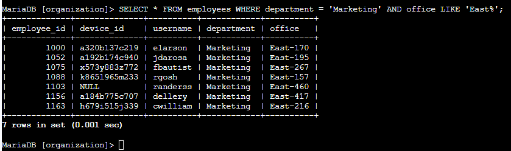
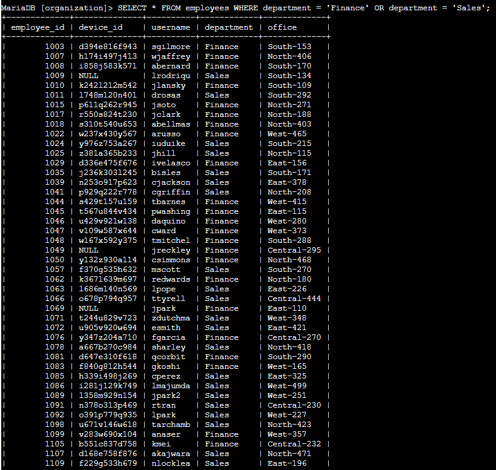
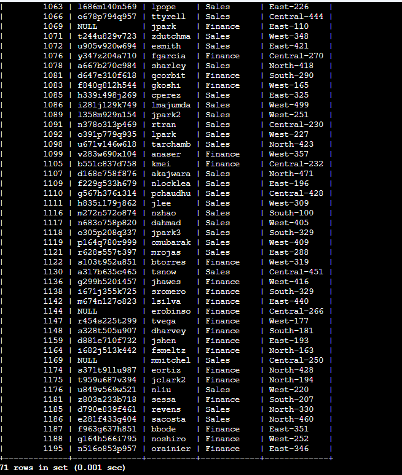
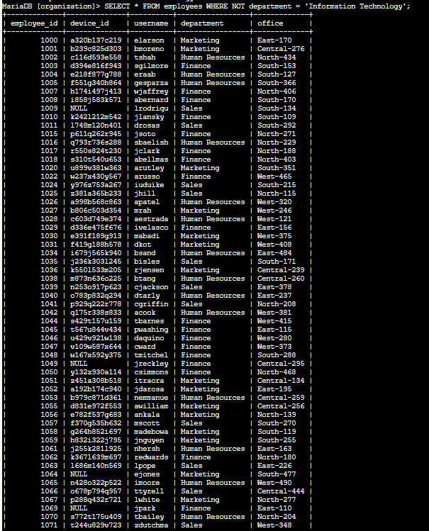
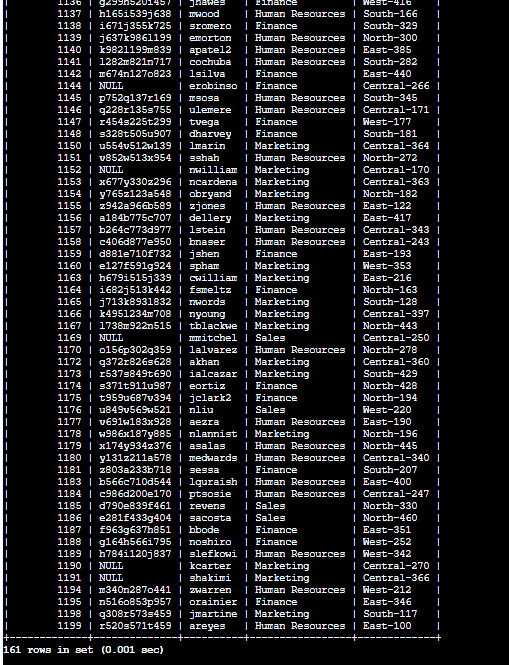

# SQL Security Filtering – AND, OR, and NOT Operators

## Project Overview

As part of a cybersecurity analyst simulation, I used SQL to investigate potential security threats and support employee machine updates within an organization's database. This project demonstrates how to apply complex filtering logic using the `AND`, `OR`, and `NOT` operators in SQL to isolate specific records from large datasets.

**Database Used:** `organization` (MariaDB)  
**Tables Used:** `log_in_attempts`, `employees`

---

## Skills Demonstrated

- Filtering with logical operators: `AND`, `OR`, `NOT`
- Pattern matching with `LIKE` and `%` wildcard
- Working with Boolean data types in SQL
- Querying across multiple tables and columns

---

## Tasks

### Task 1 – Retrieve After-Hours Failed Login Attempts

**Objective:** Identify all failed login attempts that occurred after business hours (after 18:00).

**Query:**
```sql
SELECT *
FROM log_in_attempts
WHERE login_time > '18:00' AND success = FALSE;
```



**Result:** 19 failed login attempts occurred after 18:00.

---

### Task 2 – Retrieve Login Attempts on Specific Dates

**Objective:** Investigate a suspicious event by retrieving all login attempts on `2022-05-09` and the day before, `2022-05-08`.

**Query:**
```sql
SELECT *
FROM log_in_attempts
WHERE login_date = '2022-05-09' OR login_date = '2022-05-08';
```



**Result:** 75 login attempts were made across those two days.

---

### Task 3 – Retrieve Login Attempts Outside of Mexico

**Objective:** Filter out login attempts that did not originate in Mexico. The country field includes both `MEX` and `MEXICO`, so a wildcard pattern was used.

**Query:**
```sql
SELECT *
FROM log_in_attempts
WHERE NOT country LIKE 'MEX%';
```





**Result:** 144 login attempts were made outside of Mexico.

---

### Task 4 – Retrieve Employees in Marketing (East Building)

**Objective:** Locate Marketing department employees in the East building to support a machine update. Office values follow a pattern like `East-170` or `East-320`.

**Query:**
```sql
SELECT *
FROM employees
WHERE department = 'Marketing' AND office LIKE 'East%';
```



**Result:** The first employee returned was `elarson`.

---

### Task 5 – Retrieve Employees in Finance or Sales

**Objective:** Identify employees in either the Finance or Sales departments for a separate machine update.

**Query:**
```sql
SELECT *
FROM employees
WHERE department = 'Finance' OR department = 'Sales';
```




**Result:** The first Sales department employee returned was `lrodriqu`.

---

### Task 6 – Retrieve All Employees Not in IT

**Objective:** A machine update was already applied to the IT department. Retrieve all other employees to ensure no one is missed.

**Query:**
```sql
SELECT *
FROM employees
WHERE NOT department = 'Information Technology';
```




**Result:** 161 employees are not in the Information Technology department.

---

## Repository Structure

```
sql-security-filtering/
├── README.md
├── queries.sql
└── screenshots/
    ├── task1_after_hours_failed_logins.png
    ├── task2_specific_dates.png
    ├── task3_outside_mexico_1.png
    ├── task3_outside_mexico_2.png
    ├── task3_outside_mexico_3.png
    ├── task4_marketing_east.png
    ├── task5_finance_or_sales_1.png
    ├── task5_finance_or_sales_2.png
    ├── task6_not_IT_1.png
    └── task6_not_IT_2.png
```

---

*This project was completed as part of the Google Cybersecurity Certificate program.*
